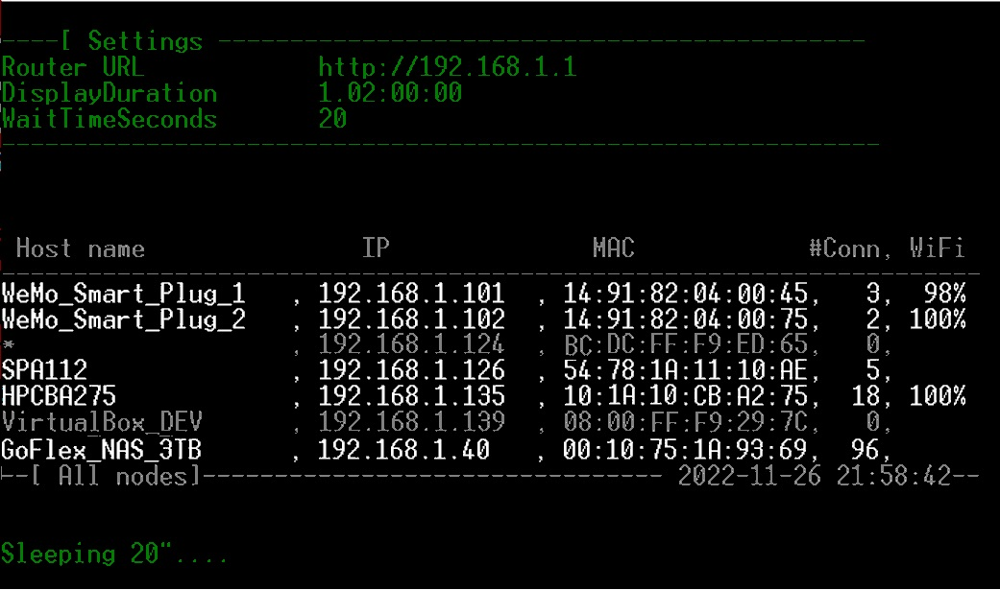
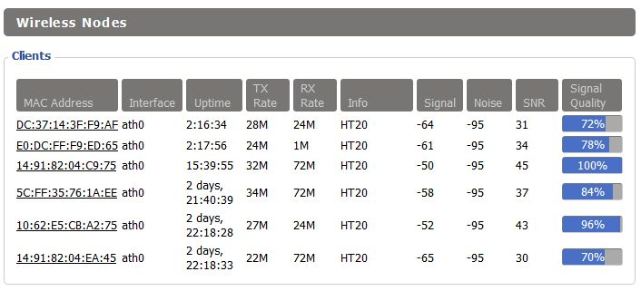

## DD-WRT API 

**About:**  
 - Minimalistic API library to communicate with a network router powered by [DD-WRT](https://dd-wrt.com/) firmware.
 - The Repo contains: 
      - the API 
      - a console app that uses this API.   

<!--

-->

<image src="DD-WRT_API/Docs/DD-WRT-Demo.jpg" 
height="450" 
alt="DD-WRT-API Demo" 
title="The console app in action:"> 
The console app in action

## Table of Contents

- [API's Features](#api-features)
- [Setup](#setup)
- [Usage](#usage)
    - [List of commands](#list-of-commands)
- [Implementation details](#implementation-details)
- [History](#history)
- [## How I used this project?](#how-i-used-this-project)
- [What is a DD-WRT router?](#what-is-a-dd-wrt-router)
- [Links](#links)
- [Similar projects](#similar-projects)

## API Features
 - List WiFi devices
 - List Active devices
 - List All devices (Wired, WiFi, Active, and no longer active)
 - Reboot the router

## Setup  
Before using please modify the *app.config* file:
 - *Username* and *Password* 
 - *RouterUrl*  (router's IP needs to be prefixed with http:// such as http://192.168.0.1)
 - *DisplayDuration* in format Days.HH:mm:ss = the duration the app will run
 - *WaitTimeSeconds* = [when reading data] the time between two subsequent data readings from router.

## Usage  
The command line app accepts *zero*, *one* or *four* parameters:
  -  **0 (zero) parameters**:   
     If configured correctly, the app will display all users in a useful format (see below *commandName* **all**) and will loop
 until the end of *DisplayDuration* with pauses of *WaitTimeSeconds* after each loop.

-  **1 parameter**: *commandName*  
This is a convenient way to run the app by just passing the command, assuming that the rest of parameters in config file are correct
  
-  **4 parameters**: *commandName,  userName, password, routerUrl*  
   The app will execute the command and will use the *userName, password* and *routerUrl* passed as arguments, so you can avoid exposing them in the config file.

### List of commands:      
   * **wifi**   - display WiFi users
   * **active** - display active users (including WiFi)
   * **lan**    - display all users
   * **all**    - combines the commands above to display all users and to indicate which ones are Active and/or WiFi
   * **reboot** - reboots the router.

## Implementation details [C#/ .NET 4.0]{#implementation-details}
 - Works only with routers flashed with [DD-WRT Firmware](https://wiki.dd-wrt.com/wiki/index.php/Installation)  
 - Tested with DD-WRT version 3.0 but it may work with other versions.  
 - Communicates with the router via its HTML Control Interface   
   Note: DD-WRT does not offer a WebAPI REST service, but anyone may extend this API and create one.
 - Targets on purpose .NET 4.0 so that it can run even on older Windows XP machines  
 
[I also wrote a reboot app that controls the router via Telnet and it seems more efficient]   

## History
This project stems from my necessity to evaluate the effectiveness of a High-Gain antenna that I acquired to enhance the WiFi signal for an outdoor IP WebCam.  
Despite the installation of the new antenna, there was no noticeable improvement.  
Consequently, I sought to obtain quantitative data to either confirm or refute my observations.

Regrettably,  DD-WRT's Control Panel proved to be challenging when deciphering device names and IPs (refer to the image below):

<!--

-->

 
DD-WRT UI - Wireless Nodes - difficult to figure-out the devices

Given that the DD-WRT UI didn't align with my requirements, I made this project to allow me to measure and record my IP WebCam's signal values for a few hours, at every 20 seconds.  

I hope that this app will be useful to others as well.  

## How I used this project?{#how-i-used-this-project}
* As mentioned above, I utilized the project to measure and record WiFi signal values into a CSV file for extended durations (two hours) and at specific intervals (every 20 seconds). 
* My measurements indicated that the <ins>11 dBi High-Gain Antenna</ins> I tested improved the WiFi signal by 2 dBi ([58% higher](https://antennatestlab.com/antenna-education-tutorials/what-is-antenna-gain-dbi-scale)).   
* Unfortunately, switching back-and-forth the old and new antennas during measurements damaged the connector and rendered my camera useless :( 
* <u>Update 2024-01-20</u>: After three years of being stored in a drawer, I have finally fixed the camera by replacing the antenna connector. It is operational once again! :) 
[To access the dome's screws and antenna connector point, I had to drill a few holes inside the camera's case.]  

## What is a DD-WRT router anyways?{#what-is-a-dd-wrt-router}
DD-WRT is Linux-based firmware for wireless routers and access points. Originally designed for the Linksys WRT54G series, it now runs on a wide variety of models. ... The remainder of the name was taken from the Linksys WRT54G model router, a home router popular in 2002–2004.   
Source: https://en.wikipedia.org/wiki/DD-WRT

## Links
 [Miles Burton - DD-WRT Web-services](https://www.milesburton.com/index.php?title=DD-WRT_Web-services&oldid=1500)   
 [My selection of DD-WRT commands](DD-WRT_API/Docs/DD-WRT_Commands.txt)   
 [ChangeLog](DD-WRT_API/Docs/ChangeLog.txt)

## Similar projects:  
[DD-WRT calling web service from Arduino ESP8266 (18 Oct.2018)](https://superuser.com/questions/988465/dd-wrt-calling-web-service-from-arduino-esp8266)

   
